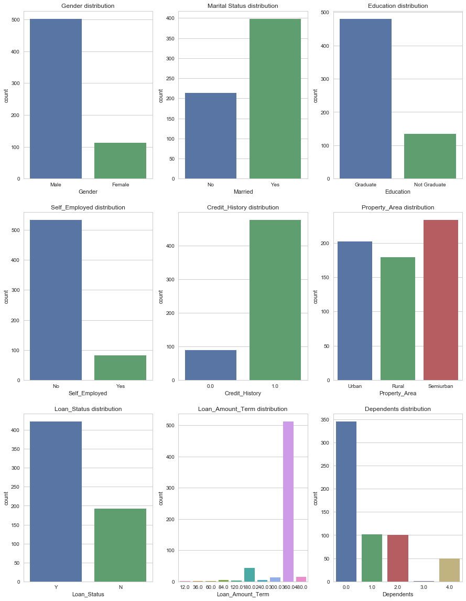
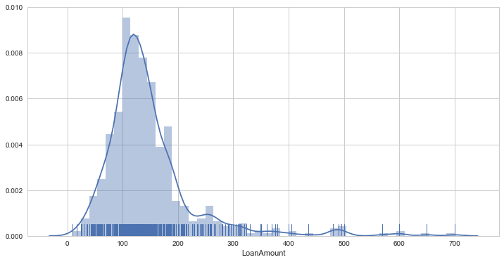
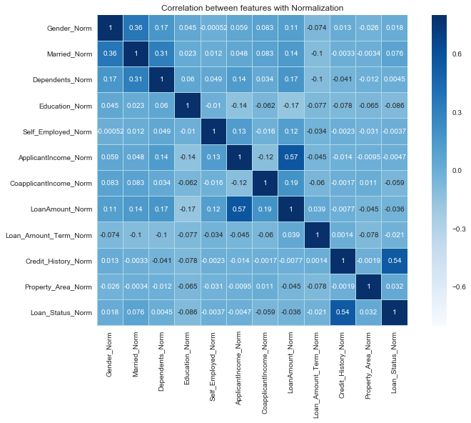
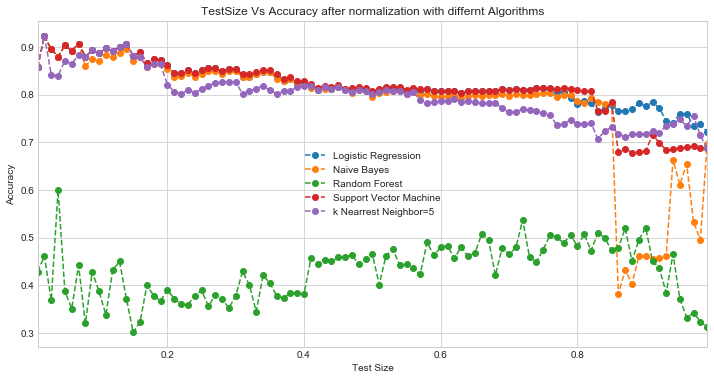

This project has asked for not only to determine whether the loan has got approved or not but also the hidden insights in the dataframe proveided in the dataframe in the form of data.

Below is my plan with which i would like to stick to if i want to do the datascience related analysis of the given dataframe.

1) Understanding Dataset
2) Data preprocessing
3) Exploratory Data Analysis (EDA)
4) Selecting Modeling Algorithm
5) Comparing different models


# 1) Understanding Dataset

**Loading python Libraries**

```python

    import numpy as np
    import pandas as pd
    import matplotlib.pyplot as plt
    import seaborn as sns
    sns.set_style('whitegrid')
    %matplotlib inline
```
**Loading the dataset**

The csv file has been loaded into the dataframe "Loan"

 ```python
    Loan = pd.read_csv('ML_Masterclass_dataset_Dec17.csv')
 ```

The dataset has total 13 columns and 614 rows

 ```python
     Loan.shape
        (614, 13)
 ```

**Types of Data**

From our initial observation we can say that the datframe is consisting of qualitative and quantitative data
There are all together 13 columns in the dataframe. The dataframe contains 7 columns which consists of categorical data i.e.

   1) Loan_ID
   2) Gender
   3) Married
   4) Education
   5) Self_Employed
   6) Property_Area
   7) Loan_Status
        
These 7 columns of categorical data are all nominal. The rest of the 6 columns out of 13 are quantitative and are as follow:

   1) Dependents
   2) ApplicantIncome
   3) CoapplicantIncome
   4) LoanAmount
   5) Loan_Amount_Term
   6) Credit_History
        
Out of these 6 quantitative columns ApplicantIncome is discrete and the rest 5 are continuous

# 2) Data preprocessing

Since the data we have in our hand is not clean, henceforth the first job would be to clean the data in various ways and convert the same into worthy of statistical use.

**1) Finding null values and data imputation**

Below are the number of null values present in respective columns:

```python
    Loan.isnull().sum()
    
    Loan_ID               0
    Gender               13
    Married               3
    Dependents           15
    Education             0
    Self_Employed        32
    ApplicantIncome       0
    CoapplicantIncome     0
    LoanAmount           22
    Loan_Amount_Term     14
    Credit_History       50
    Property_Area         0
    Loan_Status           0
    dtype: int64
```

For the sake of simplicity the value NaN has been filled with the categorical value which has occured most of the time in a specific column.As for example, since "Male" is the most frequently occured categorical value in the column "Gender" hence existing NaN value had been replaced with the catergorical value "Male". The same strategy has been applied for the column "Self Employed"

```python
    Loan = Loan.fillna({"Gender":"Male", "Self_Employed":"No"})
    Loan.drop('Loan_ID',axis=1,inplace=True)
```

**2) Converting categorical values into numerical values using Scikit-Learn Level Encoding for the main Loan dataset***

```python

from sklearn.preprocessing import LabelEncoder

    lbl_encoder = LabelEncoder()
    Loan["Gender"] = lbl_encoder.fit_transform(Loan["Gender"])
    Loan["Married"] = lbl_encoder.fit_transform(Loan["Married"])
    Loan["Education"] = lbl_encoder.fit_transform(Loan["Education"])
    Loan["Self_Employed"] = lbl_encoder.fit_transform(Loan["Self_Employed"])
    Loan["Property_Area"] = lbl_encoder.fit_transform(Loan["Property_Area"])
    Loan["Loan_Status"] = lbl_encoder.fit_transform(Loan["Loan_Status"])
```

**3) Dropping the column which is overpopulated with null values** 

Below steps are being followed in order to figure out as to which column to be dropped. 

a) Columns that contain null values have been identified. 
b) Null values for each column has been converted into the percentage.
c) If the percentage of the null value present in any column is greater than 15 %, the column has been dropped.
  

a)Finding out the null values in the column

```python
Loan.isnull().sum()

    Gender                0
    Married               0
    Dependents           15
    Education             0
    Self_Employed         0
    ApplicantIncome       0
    CoapplicantIncome     0
    LoanAmount           22
    Loan_Amount_Term     14
    Credit_History       50
    Property_Area         0
    Loan_Status           0
    dtype: int64
```

b) Calculating the percentage of Null values in the dataframe

```python
    Loan_null = pd.DataFrame((Loan.isnull().sum()),columns=['Null_Values'])
    Loan_null['%ofNullValeues'] = ((Loan_null['Null_Values'])/614*100).sort_values(ascending=True)
    Loan_null

                Null_Values   %ofNullValeues

    Loan_ID              0    0.000000
    Gender              13    2.117264
    Married              3    0.488599
    Dependents          15    2.442997
    Education            0    0.000000
    Self_Employed       32    5.211726
    ApplicantIncome      0    0.000000
    CoapplicantIncome    0    0.000000
    LoanAmount          22    3.583062
    Loan_Amount_Term    14    2.280130
    Credit_History      50    8.143322
    Property_Area        0    0.000000
    Loan_Status          0    0.000000
```

c) So, the maximum number of null values **(8.14%)** present in the column ***Credit_History***. Since the number of null values present is far below 15% and henceforth there is no need to drop any of the column from the dataframe.

Inspite of that, those null values can be replaced with the suitable values i.e. 0, mean, median or mode.

Number of null values present in the columns are as below :
    
   1) Dependents **(15)**
   2) LoanAmount **(22)**
   3) Loan_Amount_Term **(14)**
   4) Credit_History **(50)**

**4) Replacing missing values of NAN values with 0 and mean**

```python
    Loan['Dependents'].fillna(value=0,axis=0,inplace=True)
    Loan['LoanAmount'].fillna(value=Loan['LoanAmount'].mean(),axis=0,inplace=True)
    Loan['Loan_Amount_Term'].fillna(value=Loan['Loan_Amount_Term'].mean(),axis=0,inplace=True)
    Loan['Credit_History'].fillna(value=Loan['Credit_History'].mean(),axis=0,inplace=True)
```
From the below info of dataframe it is found that all the NaN values have been replaced with sutitable value depending upon the types of the data

```python
Loan.info()
    <class 'pandas.core.frame.DataFrame'>
    RangeIndex: 614 entries, 0 to 613
    Data columns (total 12 columns):
    Gender               614 non-null int64
    Married              614 non-null int64
    Dependents           614 non-null float64
    Education            614 non-null int64
    Self_Employed        614 non-null int64
    ApplicantIncome      614 non-null int64
    CoapplicantIncome    614 non-null float64
    LoanAmount           614 non-null float64
    Loan_Amount_Term     614 non-null float64
    Credit_History       614 non-null float64
    Property_Area        614 non-null int64
    Loan_Status          614 non-null int64
    dtypes: float64(5), int64(7)
    memory usage: 57.6 KB
```   

**5) Normalization**

Below python code has been used in order to implement the normalization in the present dataset. The scale of the values of all the columns have been normalized in between 0 and 1.

```python
    from sklearn import preprocessing
    import pandas as pd
    x = Loan.values 
    min_max_scaler = preprocessing.MinMaxScaler()
    x_scaled = min_max_scaler.fit_transform(x)
    Loan_Norm = pd.DataFrame(x_scaled)

    Loan_Norm.columns = ['Gender_Norm', 'Married_Norm', 'Dependents_Norm', 'Education_Norm', 'Self_Employed_Norm',           'ApplicantIncome_Norm', 'CoapplicantIncome_Norm', 'LoanAmount_Norm', 'Loan_Amount_Term_Norm', 'Credit_History_Norm', 'Property_Area_Norm', 'Loan_Status_Norm']

```

# 3) Extrapolatory Data Analysis

Bar plots have been used in order to dig into the datsets to extract the hidden information.
Below are the barplots of several independent and dependent variables.

```python
    f,ax=plt.subplots(2,3,figsize=(12,12))
    sns.countplot('Gender',data=Loan,ax=ax[0,0])
    ax[0,0].set_title('Gender distribution')
    sns.countplot('Married',data=Loan,ax=ax[0,1])
    ax[0,1].set_title('Marital Status distribution')
    sns.countplot('Education',data=Loan,ax=ax[0,2])
    ax[0,2].set_title('Education distribution')
    sns.countplot('Self_Employed',data=Loan,ax=ax[1,0])
    ax[1,0].set_title('Self_Employed distribution')
    sns.countplot('Credit_History',data=Loan,ax=ax[1,1])
    ax[1,1].set_title('Credit_History distribution')
    sns.countplot('Property_Area',data=Loan,ax=ax[1,2])
    ax[1,2].set_title('Property_Area distribution')
    sns.countplot('Loan_Status',data=Loan,ax=ax[2,0])
    ax[2,0].set_title('Loan_Status distribution')
    sns.countplot('Loan_Amount_Term',data=Loan,ax=ax[2,1])
    ax[2,1].set_title('Loan_Amount_Term distribution')
    sns.countplot('Dependents',data=Loan,ax=ax[2,2])
    ax[2,2].set_title('Dependents distribution')
```
   


In a nuttshell, the gist of the analysis is as below : 
        
   1)  Number of "Male" is more in the observation.
   2)  There are more number of married couples present in the dataset. This also signifies that married people are inclined 
        towards taking loan.
   3)  here are more number of Graduates present among those who have applied for the Loan. 
   4)  People who are self employed are not so comfortable or sure in applying for the loan.
   5)  People who hail from semiurban are more inclined towards applying for loan as compare to those who are from Urban or Rural.
   6)  Most of the loan applications have been approved.
   7)  Most of the people opted for loan amount term of 360 days.
   8)  More people with 0 dependent applied for the loans


**Further analysis gave us following points:**

```python
   Loan.groupby(['Gender','Loan_Status'])['Education'].count()

    Gender  Loan_Status
    Female  N               37
            Y               75
    Male    N              155
            Y              347
    Name: Education, dtype: int64
```
   9) More number of male applicants' loans got approved as compared to female applicants.

```python
   Loan.groupby(['Education','Loan_Status'])['Loan_Status'].count()

    Education     Loan_Status
    Graduate      N              140
                  Y              340
    Not Graduate  N               52
                  Y               82
    Name: Loan_Status, dtype: int64
```
   10) More loans of "Graduates" got approved as compared to "Not Graduates"
   
```python   
   Loan.groupby(['Property_Area','Loan_Status'])['Loan_Status'].count()
   
    Property_Area  Loan_Status
    Rural          N               69
                   Y              110
    Semiurban      N               54
                   Y              179
    Urban          N               69
                   Y              133
    Name: Loan_Status, dtype: int64
 ``` 
   11) If the property is situated in semiurban area, the chances of getting loan approved is high as comapared to Rural or Urban.
  
 ```python
    Loan.groupby(['Self_Employed','Loan_Status'])['Loan_Status'].count()
    Self_Employed  Loan_Status
    No             N              166
                   Y              366
    Yes            N               26
                   Y               56
    Name: Loan_Status, dtype: int64
```
   12) Loan term of 360 got maximum approval.
  
```python
   Loan.groupby(['Loan_Amount_Term','Loan_Status'])['Loan_Status'].count()
  
        Loan_Amount_Term  Loan_Status
    12.0              Y                1
    36.0              N                2
    60.0              Y                2
    84.0              N                1
                      Y                3
    120.0             Y                3
    180.0             N               15
                      Y               29
    240.0             N                1
                      Y                3
    300.0             N                5
                      Y                8
    360.0             N              153
                      Y              359
    480.0             N                9
                      Y                6
    Name: Loan_Status, dtype: int64
```  
   
   13) Most of the loan applications of self employed individuals got rejected.
   
 ```python

        Loan.groupby(['Self_Employed','Loan_Status'])['Loan_Status'].count()

            Self_Employed  Loan_Status
        No             N              166
                       Y              366
        Yes            N               26
                       Y               56
        Name: Loan_Status, dtype: int64
  ```

   14) Loans of applicants with 0 dependents got more approved as compared to other applicants. Mainly, because it has been percieved   that applicants with 0 dependents have lesser liabilities.
 
```python
    Loan.groupby(['Dependents','Loan_Status'])['Loan_Status'].count()
        Dependents  Loan_Status
    0.0         N              107
                Y              238
    1.0         N               36
                Y               66
    2.0         N               25
                Y               76
    3.0         N                1
    4.0         N               17
                Y               33
    Name: Loan_Status, dtype: int64
```

**Histogram**

  Histogram is a technique to do extrapolatory data analysis of any dataset with the visual method.

    ```python
    import seaborn as sns
    sns.distplot(Loan['ApplicantIncome'],color='r')
    ```


From the above histogram of ***ApplicantIncome*** column we can see that the distribution is heavily positively skewed. 
Also the ***skewness*** and the ***kurtosis*** is really high as calculated below.

    ```python
    print("Skewness: %f" % Loan['ApplicantIncome'].skew())
    print("Kurtosis: %f" % Loan['ApplicantIncome'].kurt())

        Skewness: 6.539513
        Kurtosis: 60.540676
    ```

In order to achieve a more acceptable distribution we took the ***log*** of column ***ApplicantIncome*** and ploted the histogram.
From the below graph it can infered that heavily skewed distribution has been replaced by a reasonable normal distribution.

    ```python
    import seaborn as sns
    import numpy as np
    sns.distplot(np.log(Loan['ApplicantIncome']),color='b')
    ```


    ```python
    print("Skewness: %f" % np.log(Loan['ApplicantIncome']).skew())
    print("Kurtosis: %f" % np.log(Loan['ApplicantIncome']).kurt())

        Skewness: 0.479580
        Kurtosis: 3.686875
    ```

From the below plot of normal distribution of ***LoanAmount*** we can infer that the distribution is a little positively skewed with a moderately high peak ( high kurtosis )

    ```python
    import seaborn as sns
    sns.distplot(Loan['LoanAmount'],color='r')
    ```



    ```python
    print("Skewness: %f" % Loan['LoanAmount'].skew())
    print("Kurtosis: %f" % Loan['LoanAmount'].kurt())

        Skewness: 2.726601
        Kurtosis: 10.896456
    ```

So to make the distribution look more normal again the same procedure has been followed.

    ```python
    import seaborn as sns
    import numpy as np
    sns.distplot(np.log(Loan['LoanAmount']),color='b')
    ```


The distribution is slightly negatively skewed

    ```python
    print("Skewness: %f" % np.log(Loan['LoanAmount']).skew())
    print("Kurtosis: %f" % np.log(Loan['LoanAmount']).kurt())
    ```

    Skewness: -0.223227
    Kurtosis: 2.799973
    

    ```python
    import seaborn as sns
    sns.distplot(Loan['CoapplicantIncome'],color='r')
    ```


    ```python
    Loan['CoapplicantIncome'].loc[Loan['CoapplicantIncome'] == 0] = 1
    ```
The value 0 has been replaced with 1 as log(0) is undefined and we wont able to plot the histogram.

    ```python
    import seaborn as sns
    sns.distplot(np.log(Loan['CoapplicantIncome']),color='b')
    ```


Frome the above distribution of the log value of CoapplicantIncome it has been found that the range of the modified CoapplicantIncome varied from -3.00 to +13.00. For the rest of the columns, the range varied from 0 to 1. Henceforth, the idea of normalizing the data by taking the log of the column values will not work here. 


**Multivariate Analysis**

In multivariate analysis we tried to figure out the pearson correlation coefficient among different columns using a heatmap.

```python
    corr=Loan.corr()#["Loan_Status"]
    plt.figure(figsize=(12, 8))

    sns.heatmap(corr, 
                vmax=.8, 
                linewidths=0.01,
                square=True,
                annot=True,
                cmap='Blues',
                linecolor="lightblue")
    plt.title('Correlation between features');
```


From the above heatmap we can conclude following things:

  1) Customers ***Credit history*** has got a huge influence in getting the approval of the Loan (corr=0.54)
  2) The more is the ***applicant's income*** the more chance is there to get the loan (corr=0.57)
  3) The bigger is the ***loan amount*** the lesser is the chance of getting the loan to be approved(corr=-0.036)

Below is the pairplot which clearly shows the scatter plot in between different columns of loan dataset and how they are correlated or even they are related whatsoever

**Normalization**

Below python code has been used in order to implement the normalization in the present dataset. The scale of the values of all the columns have been normalized in between 0 and 1.

```python
    from sklearn import preprocessing
    import pandas as pd
    x = Loan.values 
    min_max_scaler = preprocessing.MinMaxScaler()
    x_scaled = min_max_scaler.fit_transform(x)
    Loan_Norm = pd.DataFrame(x_scaled)

    Loan_Norm.columns = ['Gender_Norm', 'Married_Norm', 'Dependents_Norm', 'Education_Norm', 'Self_Employed_Norm',           'ApplicantIncome_Norm', 'CoapplicantIncome_Norm', 'LoanAmount_Norm', 'Loan_Amount_Term_Norm', 'Credit_History_Norm', 'Property_Area_Norm', 'Loan_Status_Norm']

```
Heatmap plot after doing the normalizing the scale of all the columns in between range 0 and 1

```python
    corr=Loan_Norm.corr()
    plt.figure(figsize=(12, 8))

    sns.heatmap(corr, 
                vmax=.8, 
                linewidths=0.01,
                square=True,
                annot=True,
                cmap='Blues',
                linecolor="lightblue")
    plt.title('Correlation between features with Normalization');
```



Even though the scale has been normalized in a scale of 0 and 1, no significant differences have been found in the pearson correlation coefficients between multple independent variables. Henceforth, it can be concluded that normalization did not play any significant role in data preprocessing.

# 4) Selecting Modeling Algorithm

Below are the models been used to predict the status of the loan. ( whether it is issued or not ? )

   1) Logistic Regression
   2) Support Vector Machine
   3) K Nearest Neighbour 
   4) Naive Bayes
   5) Random Forrest
   
An effort has been made to find out the accuracies for all the possible test size from 0.01 to 0.99 for a specific model. 
Graphs have been plotted against test sizes and accuracies for all the above-mentioned models and eventually been compared by plotting them in a single frame.

**Splittig the dataframe in training and test sample and choosing different algorithms**

Before splitting the dataframe dataframe has been splitted into seperate dataframe. One datframe(Y) will have the target variable i.e. ***Loan_Status*** and the other (X) will contain the rest of the independent variables. 

```python
   Y = Loan['Loan_Status']
   X = pd.concat([Loan['Gender'], Loan['Married'], Loan['Dependents'], Loan['Education'], Loan['Self_Employed'], Loan['ApplicantIncome'], Loan['CoapplicantIncome'], Loan['LoanAmount'], Loan['Loan_Amount_Term'], Loan['Credit_History'], Loan['Property_Area']],axis=1) 
```

```python
   Y.shape, X.shape
    ((614L,), (614, 11))
```

Below predictive models have been used on the **dataset** which has **not been normalized**.

**Logistic Regression** 

```python

    import numpy as np
    #from array import array
    from sklearn.linear_model import LogisticRegression
    from sklearn.cross_validation import train_test_split
    from sklearn import metrics

    test_size = np.arange(0.01,1,0.01)
    accuracyl = []


    for t in test_size:

    logreg = LogisticRegression()
    X_train,X_test,Y_train,Y_test = train_test_split(X,Y,test_size=t, random_state = 3)
    X_train = X_train.reset_index(drop=True)
    X_test = X_test.reset_index(drop=True)
    Y_train = Y_train.reset_index(drop=True)
    Y_test = Y_test.reset_index(drop=True)
    logreg = LogisticRegression()
    logreg.fit(X_train,Y_train)
    Y_pred_logreg = logreg.predict(X_test)
    accuracyl.append(metrics.accuracy_score(Y_test,Y_pred_logreg))

    plt.figure(figsize=(10,5))
    plt.plot(test_size,accuracyl,color='b')
    plt.xlabel('Sample Test Size')
    plt.ylabel('Testing Accuracy')
    plt.title('Plot Accuracy Vs Testsize Using Logisitic Regression')

```


**Support Vector Machine** 

```python
    from sklearn.svm import SVC
    from sklearn import metrics

    accuracys = []

for t in test_size:

    X_train,X_test,Y_train,Y_test = train_test_split(X,Y,test_size=t, random_state = 3)
    X_train = X_train.reset_index(drop=True)
    X_test = X_test.reset_index(drop=True)
    Y_train = Y_train.reset_index(drop=True)
    Y_test = Y_test.reset_index(drop=True)
    model = SVC()
    model.fit(X_train,Y_train)
    Y_pred_SVC = model.predict(X_test)
    accuracys.append(metrics.accuracy_score(Y_test,Y_pred_SVC))
    
    plt.figure(figsize=(10,5))
    plt.plot(test_size,accuracys,color='g')
    plt.xlabel('Sample Test Size')
    plt.ylabel('Testing Accuracy')
    plt.title('Plot Accuracy Vs Testsize Using Support Vector Machine')
```


**K Nearest Neighbour** 

```python

    import numpy as np
    from sklearn.neighbors import KNeighborsClassifier

    test_size = np.arange(0.01,1,0.01)

    accuracyk1 = []
    accuracyk2 = []
    accuracyk3 = []
    accuracyk4 = []
    accuracyk5 = []
    accuracyk6 = []

    for t in test_size:
    
    X_train,X_test,Y_train,Y_test = train_test_split(X,Y,test_size=t, random_state = 3)
    X_train = X_train.reset_index(drop=True)
    X_test = X_test.reset_index(drop=True)
    Y_train = Y_train.reset_index(drop=True)
    Y_test = Y_test.reset_index(drop=True)
    
    #for neighbours =1:
    knn1 = KNeighborsClassifier(n_neighbors = 1)
    knn1.fit(X_train,Y_train)
    Y_pred_knn1 = knn1.predict(X_test)
    accuracyk1.append(metrics.accuracy_score(Y_test,Y_pred_knn1))
        
    #for n_neighbors = 2 :
    knn2 = KNeighborsClassifier(n_neighbors = 2)
    knn2.fit(X_train,Y_train)
    Y_pred_knn2 = knn2.predict(X_test)
    accuracyk2.append(metrics.accuracy_score(Y_test,Y_pred_knn2))
    
    #for n_neighbors = 3 :
    knn3 = KNeighborsClassifier(n_neighbors = 3)
    knn3.fit(X_train,Y_train)
    Y_pred_knn3 = knn3.predict(X_test)
    accuracyk3.append(metrics.accuracy_score(Y_test,Y_pred_knn3))
    
    #for n_neighbors = 4 :
    knn4 = KNeighborsClassifier(n_neighbors = 4)
    knn4.fit(X_train,Y_train)
    Y_pred_knn4 = knn4.predict(X_test)
    accuracyk4.append(metrics.accuracy_score(Y_test,Y_pred_knn4))
    
    #for n_neighbors = 5 :
    knn5 = KNeighborsClassifier(n_neighbors = 5)
    knn5.fit(X_train,Y_train)
    Y_pred_knn5 = knn5.predict(X_test)
    accuracyk5.append(metrics.accuracy_score(Y_test,Y_pred_knn5))
    
    #for n_neighbors = 6 :
    knn6 = KNeighborsClassifier(n_neighbors = 6)
    knn6.fit(X_train,Y_train)
    Y_pred_knn6 = knn6.predict(X_test)
    accuracyk6.append(metrics.accuracy_score(Y_test,Y_pred_knn6))

    plt.figure(figsize=(15,7))
    plt.xlabel('Sample Test Size')
    plt.ylabel('Testing Accuracy')
    plt.title('Plot Accuracy Vs Testsize Using K Nearest Neighbour with neighbours = 1,2,3,4,5,6')

    ax1 = plt.plot(test_size,accuracyk1,color='red')
    ax2 = plt.plot(test_size,accuracyk2,color='blue')
    ax3 = plt.plot(test_size,accuracyk3,color='green')
    ax4 = plt.plot(test_size,accuracyk4,color='grey')
    ax5 = plt.plot(test_size,accuracyk5,color='brown')
    ax6 = plt.plot(test_size,accuracyk6,color='yellow')

    plt.figtext(0.6,0.8, "red, neighbour = 1")
    plt.figtext(0.6,0.77, "blue, neighbour = 2")
    plt.figtext(0.6,0.74, "green, neighbour = 3")
    plt.figtext(0.6,0.71, "grey, neighbour = 4")
    plt.figtext(0.6,0.68, "brown, neighbour = 5")
    plt.figtext(0.6,0.65, "yellow, neighbour = 6")
```


**Naive Bayes** 

```python

    import numpy as np
    from sklearn.naive_bayes import GaussianNB
    from sklearn.cross_validation import train_test_split

    test_size = np.arange(0.01,1,0.01)
    accuracyn = []

    for t in test_size:
    
    model = GaussianNB()
    X_train,X_test,Y_train,Y_test = train_test_split(X,Y,test_size=t, random_state = 3)
    X_train = X_train.reset_index(drop=True)
    X_test = X_test.reset_index(drop=True)
    Y_train = Y_train.reset_index(drop=True)
    Y_test = Y_test.reset_index(drop=True)
    
    model.fit(X_train,Y_train)
    Y_pred_NB = model.predict(X_test)
    accuracyn.append(metrics.accuracy_score(Y_test,Y_pred_NB))

    plt.figure(figsize=(10,5))
    plt.plot(test_size,accuracyn,color='purple')
    plt.xlabel('Sample Test Size')
    plt.ylabel('Testing Accuracy')
    plt.title('Plot Accuracy Vs Testsize Using Naive Bayes')
```


**Random Forrest Regression**

```python

    import numpy as np
    from sklearn.ensemble import RandomForestRegressor
    from sklearn.cross_validation import train_test_split

    test_size = np.arange(0.01,1,0.01)
    accuracyrf = []

    for t in test_size:
    
    rfr = RandomForestRegressor() 
    X_train,X_test,Y_train,Y_test = train_test_split(X,Y,test_size=t, random_state = 3)
    X_train = X_train.reset_index(drop=True)
    X_test = X_test.reset_index(drop=True)
    Y_train = Y_train.reset_index(drop=True)
    Y_test = Y_test.reset_index(drop=True)
    
    rfr.fit(X_train,Y_train)
    Y_pred_RFR = rfr.predict(X_test)
    accuracyrf.append(metrics.accuracy_score(Y_test,Y_pred_RFR.astype(int)))
    
    plt.figure(figsize=(10,5))
    plt.plot(test_size,accuracyrf,color='seagreen')
    plt.xlabel('Sample Test Size')
    plt.ylabel('Testing Accuracy')
    plt.title('Plot Accuracy Vs Testsize Using Random Forrest')
```


# 5) Comparing different models

**Comparing accuracies of different models with respect to sample sizes**

A dataframe df has been craeted with the values of accuruacies of different models and different test sizes. This dataframe will contain the accuracies against the test sizes.

```python
    import numpy as np
    import pandas as pd

    t = test_size

    l = accuracyl
    s = accuracys
    k5 = accuracyk5
    n = accuracyn
    rf = accuracyrf

    df = pd.DataFrame({'test_size':t, 'Logistic Regression':l, 'Support Vector Machine':s, 'k Nearrest Neighbor=5':k5, 'Naive Bayes':n, 'Random Forest':rf})
    df.set_index('test_size',inplace=True)
    df.head()

```

<table border="1" class="dataframe">
  <thead>
    <tr style="text-align: right;">
      <th></th>
      <th>Logistic Regression</th>
      <th>Naive Bayes</th>
      <th>Random Forest</th>
      <th>Support Vector Machine</th>
      <th>k Nearrest Neighbor=5</th>
    </tr>
    <tr>
      <th>test_size</th>
      <th></th>
      <th></th>
      <th></th>
      <th></th>
      <th></th>
    </tr>
  </thead>
  <tbody>
    <tr>
      <th>0.01</th>
      <td>0.857143</td>
      <td>0.857143</td>
      <td>0.714286</td>
      <td>0.857143</td>
      <td>0.857143</td>
    </tr>
    <tr>
      <th>0.02</th>
      <td>0.923077</td>
      <td>0.923077</td>
      <td>0.461538</td>
      <td>0.923077</td>
      <td>0.846154</td>
    </tr>
    <tr>
      <th>0.03</th>
      <td>0.894737</td>
      <td>0.894737</td>
      <td>0.526316</td>
      <td>0.894737</td>
      <td>0.736842</td>
    </tr>
    <tr>
      <th>0.04</th>
      <td>0.880000</td>
      <td>0.880000</td>
      <td>0.440000</td>
      <td>0.880000</td>
      <td>0.760000</td>
    </tr>
    <tr>
      <th>0.05</th>
      <td>0.903226</td>
      <td>0.903226</td>
      <td>0.419355</td>
      <td>0.903226</td>
      <td>0.806452</td>
    </tr>
  </tbody>
</table>
</div>

The accuracies of different models have been plotted in a single frame where we can see that the random forest model is following a completely different trajectory as compared to other models. On the other hand, the slope of logistic regression and support vector machine goes hand in hand.

```python
    import plotly.plotly as py
    import plotly.graph_objs as go
    import numpy as np
    import pandas as pd
    import matplotlib.pyplot as plt

    ax = df.plot(legend=True, figsize=(12,6),linestyle='--',marker='o', title='TestSize Vs Accuracy with differnt Algorithms')
    ax.set_xlabel("Test Size")
    ax.set_ylabel("Accuracy")
```


A new dataframe has been created which contains maximum and minium values of the accuracies of the models. 

```python

    LG = [df['Logistic Regression'].max(),df['Logistic Regression'].min()]
    NB = [df['Naive Bayes'].max(),df['Naive Bayes'].min()]
    RF = [df['Random Forest'].max(),df['Random Forest'].min()]
    KNN = [df['k Nearrest Neighbor=5'].max(),df['k Nearrest Neighbor=5'].min()]
    SVM = [df['Support Vector Machine'].max(),df['Support Vector Machine'].min()]

    Measure = ['Max','Min']

    df_algo_max_min = pd.DataFrame({'Accuracy Value':Measure, 'Logistic Regression':LG, 'Naive Bayes':NB, 'Support Vector Machine':SVM, 'k Nearrest Neighbor=5':KNN, 'Random Forest':RF})
    df_algo_max_min.set_index('Accuracy Value',inplace=True)
    df_algo_max_min.head()
```

<table border="1" class="dataframe">
  <thead>
    <tr style="text-align: right;">
      <th></th>
      <th>Logistic Regression</th>
      <th>Naive Bayes</th>
      <th>Random Forest</th>
      <th>Support Vector Machine</th>
      <th>k Nearrest Neighbor=5</th>
    </tr>
    <tr>
      <th>Accuracy Value</th>
      <th></th>
      <th></th>
      <th></th>
      <th></th>
      <th></th>
    </tr>
  </thead>
  <tbody>
    <tr>
      <th>Max</th>
      <td>0.923077</td>
      <td>0.923077</td>
      <td>0.714286</td>
      <td>0.923077</td>
      <td>0.857143</td>
    </tr>
    <tr>
      <th>Min</th>
      <td>0.644295</td>
      <td>0.381853</td>
      <td>0.339286</td>
      <td>0.676417</td>
      <td>0.632550</td>
    </tr>
  </tbody>
</table>
</div>

The maximum and minimum values of the dataframe has been plotted in a single frame in order to compare the different slopes of different algorithms among each other. From the graph, it can be found that negative slope of the random forest algorithm is way more stipper as compare to other algorithms. The slope of logistic regression and support vector machines are almost equal.

```python
    import numpy as np
    import pandas as pd
    import matplotlib.pyplot as plt

    ax = df_algo_max_min.plot(legend=True, figsize=(10,7),linestyle='--',marker='o', title='Accuracy with differnt Algorithms')
    ax.set_xlabel("Accuracy_Value")
    ax.set_ylabel("Algo")
```


If we will use all above mentioned 5 models with the normalized version of the datset, all the plots of ***accuracy vs test size*** of all 5 algorithms would look as shown in the below frame.




**Normal distribution of different models**

Below is thet plot of normla distribution of the accuracies of several models.

```python
   import seaborn as sns
   f,ax=plt.subplots(3,2,figsize=(12,18))
   sns.distplot(df['Logistic Regression'],ax=ax[0,0])
   ax[0,0].set_title('Normal distribution of accuracy of Logistic Regression')
   sns.distplot(df['Naive Bayes'],ax=ax[0,1])
   ax[0,1].set_title('Normal distribution of accuracy of Naive Bayes')
   sns.distplot(df['Random Forest'],ax=ax[1,0])
   ax[1,0].set_title('Normal distribution of accuracy of Random Forest')
   sns.distplot(df['Support Vector Machine'],ax=ax[1,1])
   ax[1,1].set_title('Normal distribution of accuracy of Support Vector Machine')
   sns.distplot(df['k Nearrest Neighbor=5'],ax=ax[2,0])
   ax[2,0].set_title('Normal distribution of accuracy of k Nearrest Neighbor=5')
```


**Comaprative analysis of different models using pair plot**

From the below graph it is highly evident that the values of the acccuracies of Logistic Regression and Support Vector Machine are highly positively correlated.

Random forest has a negative correlation with all other predictive models. 

```python
    sns.pairplot(df)
```


