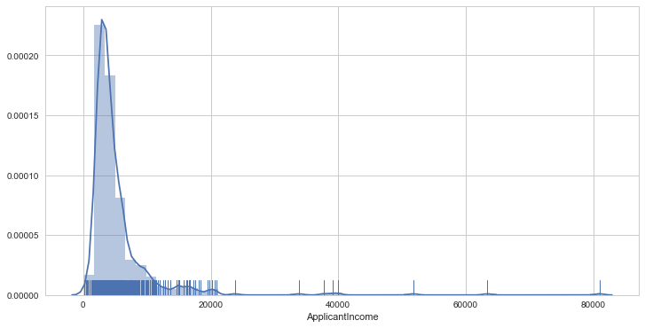
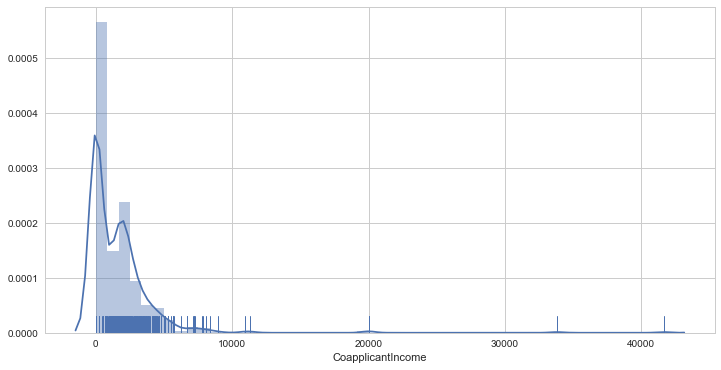

**Loading python Libraries**

```python
import numpy as np
import pandas as pd
import matplotlib.pyplot as plt
import seaborn as sns
sns.set_style('whitegrid')
%matplotlib inline
```
**Loading the dataset**

The csv file has been loaded into the dataframe "Loan"

```python
Loan = pd.read_csv('ML_Masterclass_dataset_Dec17.csv')
```

```python
Loan.shape
```
    (614, 13)

The dataset has total 13 columns and 614 rows

```python
Loan.info()
```
    <class 'pandas.core.frame.DataFrame'>
    RangeIndex: 614 entries, 0 to 613
    Data columns (total 13 columns):
    Loan_ID              614 non-null object
    Gender               601 non-null object
    Married              611 non-null object
    Dependents           599 non-null float64
    Education            614 non-null object
    Self_Employed        582 non-null object
    ApplicantIncome      614 non-null int64
    CoapplicantIncome    614 non-null float64
    LoanAmount           592 non-null float64
    Loan_Amount_Term     600 non-null float64
    Credit_History       564 non-null float64
    Property_Area        614 non-null object
    Loan_Status          614 non-null object
    dtypes: float64(5), int64(1), object(7)
    memory usage: 62.4+ KB

**Types of Data**

From our initial observation we can say that the datframe is consisting of qualitative and quantitative data
There are all together 13 columns in the dataframe. The dataframe contains 7 columns which consists of categorical data i.e.

        1) Loan_ID
        2) Gender
        3) Married
        4) Education
        5) Self_Employed
        6) Property_Area
        7) Loan_Status
        
These 7 columns of categorical data are all nominal. The rest of the 6 columns out of 13 are quantitative and are as follow:

        1) Dependents
        2) ApplicantIncome
        3) CoapplicantIncome
        4) LoanAmount
        5) Loan_Amount_Term
        6) Credit_History
        
Out of these 6 quantitative columns ApplicantIncome is discrete and the rest 5 are continuous

For continuous Data we can illustrate the information though Histogram or Boxplot


```python
Loan.isnull().sum()
```
    Loan_ID               0
    Gender               13
    Married               3
    Dependents           15
    Education             0
    Self_Employed        32
    ApplicantIncome       0
    CoapplicantIncome     0
    LoanAmount           22
    Loan_Amount_Term     14
    Credit_History       50
    Property_Area         0
    Loan_Status           0
    dtype: int64

For the sake of simplicity the value NaN has been filled with the categorical value which has occured most of the time in a specific column.As for example, since "Male" is the most frequently occured categorical value in the column "Gender" hence existing NaN value had been replaced with the catergorical value "Male". 
The same strategy has been applied for the column "Self Employed"

```python
Loan = Loan.fillna({"Gender":"Male", "Self_Employed":"No"})
Loan.drop('Loan_ID',axis=1,inplace=True)
```

**Univariate Analysis** 


```python
Loan['Gender'].value_counts()

    Male      502
    Female    112
    Name: Gender, dtype: int64
```
1) Number of "Male" is more in the observation

```python
Loan['Education'].value_counts()

    Graduate        480
    Not Graduate    134
    Name: Education, dtype: int64
```
2) There are more number of Graduates present among those who have applied for the Loan 

```python
Loan['Dependents'].value_counts()

    0.0    345
    1.0    102
    2.0    101
    4.0     50
    3.0      1
    Name: Dependents, dtype: int64
```
3) People with "0" dependent expects to get their loan approved

```python
Loan['Married'].value_counts()

    Yes    398
    No     213
    Name: Married, dtype: int64
```
4) In the observation Number of married people is more which clearly signifies that married people are inclined towards taking loan

```python
Loan['Self_Employed'].value_counts()

    No     532
    Yes     82
    Name: Self_Employed, dtype: int64
```
5) People who are self employed are not so comfortable or sure in applying for the loan  

```python
Loan['Property_Area'].value_counts()

    Semiurban    233
    Urban        202
    Rural        179
    Name: Property_Area, dtype: int64
```
6) People who hail from semiurban are more inclined towards applying for loan as compare to those who are from Urban or Rural.

```python
Loan['Loan_Status'].value_counts()

    Y    422
    N    192
    Name: Loan_Status, dtype: int64
```
7) Most of the loan applications have been approved.


In a nuttshell, the gist of the analysis is as below : 
        
    1)  Number of "Male" is more in the observation.
    2)  There are more number of Graduates present among those who have applied for the Loan. 
    3)  People with "0" dependent expects to get their loan approved.
    4)  In the observation Number of married people is more which clearly signifies that married people are inclined 
        towards taking loan.
    5)  People who are self employed are not so comfortable or sure in applying for the loan.
    6)  People who hail from semiurban are more inclined towards applying for loan as compare to those who are from Urban or Rural.
    7)  Most of the loan applications have been approved. 


**Converting categorical values to numerical values using Scikit-Learn Level Encoding for the main Loan dataset**

```python

from sklearn.preprocessing import LabelEncoder

        lbl_encoder = LabelEncoder()
        Loan["Gender"] = lbl_encoder.fit_transform(Loan["Gender"])
        Loan["Married"] = lbl_encoder.fit_transform(Loan["Married"])
        Loan["Education"] = lbl_encoder.fit_transform(Loan["Education"])
        Loan["Self_Employed"] = lbl_encoder.fit_transform(Loan["Self_Employed"])
        Loan["Property_Area"] = lbl_encoder.fit_transform(Loan["Property_Area"])
        Loan["Loan_Status"] = lbl_encoder.fit_transform(Loan["Loan_Status"])
```

```python
# Checking Null Values
Loan.isnull().sum()

    Gender                0
    Married               0
    Dependents           15
    Education             0
    Self_Employed         0
    ApplicantIncome       0
    CoapplicantIncome     0
    LoanAmount           22
    Loan_Amount_Term     14
    Credit_History       50
    Property_Area         0
    Loan_Status           0
    dtype: int64
```
**Descriptive statistics summary**

```python

Loan['LoanAmount'].describe()
    count    592.000000
    mean     146.412162
    std       85.587325
    min        9.000000
    25%      100.000000
    50%      128.000000
    75%      168.000000
    max      700.000000
    Name: LoanAmount, dtype: float64
```

```python
Loan['Loan_Amount_Term'].describe()

    count    600.00000
    mean     342.00000
    std       65.12041
    min       12.00000
    25%      360.00000
    50%      360.00000
    75%      360.00000
    max      480.00000
    Name: Loan_Amount_Term, dtype: float64
```
```python
Loan['Credit_History'].describe()

    count    564.000000
    mean       0.842199
    std        0.364878
    min        0.000000
    25%        1.000000
    50%        1.000000
    75%        1.000000
    max        1.000000
    Name: Credit_History, dtype: float64
```
```python
Loan['Credit_History'].value_counts()

    1.0    475
    0.0     89
    Name: Credit_History, dtype: int64
```
**Replacing NAN values with 0 and mean** 

```python
    Loan['Dependents'].fillna(value=0,axis=0,inplace=True)
    Loan['LoanAmount'].fillna(value=Loan['LoanAmount'].mean(),axis=0,inplace=True)
    Loan['Loan_Amount_Term'].fillna(value=Loan['Loan_Amount_Term'].mean(),axis=0,inplace=True)
    Loan['Credit_History'].fillna(value=Loan['Credit_History'].mean(),axis=0,inplace=True)
```
Fron the below info of dataframe it is found that all the NaN values have been replaced with sutitable value depending upon the types of the data

```python
Loan.info()
    <class 'pandas.core.frame.DataFrame'>
    RangeIndex: 614 entries, 0 to 613
    Data columns (total 12 columns):
    Gender               614 non-null int64
    Married              614 non-null int64
    Dependents           614 non-null float64
    Education            614 non-null int64
    Self_Employed        614 non-null int64
    ApplicantIncome      614 non-null int64
    CoapplicantIncome    614 non-null float64
    LoanAmount           614 non-null float64
    Loan_Amount_Term     614 non-null float64
    Credit_History       614 non-null float64
    Property_Area        614 non-null int64
    Loan_Status          614 non-null int64
    dtypes: float64(5), int64(7)
    memory usage: 57.6 KB
```    
**Histogram**

Histogram is a technique to do extrapolatory data analysis of any dataset with the visual method.

```python
import seaborn as sns
sns.distplot(Loan['ApplicantIncome'],color='r')
```



From the above histogram of ***ApplicantIncome*** column we can see that the distribution is heavily positively skewed. 
Also the ***skewness*** and the ***kurtosis*** is really high as calculated below.

```python
print("Skewness: %f" % Loan['ApplicantIncome'].skew())
print("Kurtosis: %f" % Loan['ApplicantIncome'].kurt())

    Skewness: 6.539513
    Kurtosis: 60.540676
```

In order to achieve a more acceptable distribution we took the ***log*** of column ***ApplicantIncome*** and ploted the histogram.
From the below graph it can infered that heavily skewed distribution has been replaced by a reasonable normal distribution.

```python
import seaborn as sns
import numpy as np
sns.distplot(np.log(Loan['ApplicantIncome']),color='b')
```


```python
print("Skewness: %f" % np.log(Loan['ApplicantIncome']).skew())
print("Kurtosis: %f" % np.log(Loan['ApplicantIncome']).kurt())

    Skewness: 0.479580
    Kurtosis: 3.686875
```

From the below plot of normal distribution of ***LoanAmount*** we can infer that the distribution is a little positively skewed with a moderately high peak ( high kurtosis )

```python
import seaborn as sns
sns.distplot(Loan['LoanAmount'],color='r')
```


```python
print("Skewness: %f" % Loan['LoanAmount'].skew())
print("Kurtosis: %f" % Loan['LoanAmount'].kurt())

    Skewness: 2.726601
    Kurtosis: 10.896456
```

So to make the distribution look more normal again the same procedure has been followed.

```python
import seaborn as sns
import numpy as np
sns.distplot(np.log(Loan['LoanAmount']),color='b')
```


The distribution is slightly negatively skewed

```python
print("Skewness: %f" % np.log(Loan['LoanAmount']).skew())
print("Kurtosis: %f" % np.log(Loan['LoanAmount']).kurt())
```

    Skewness: -0.223227
    Kurtosis: 2.799973
    

```python
import seaborn as sns
sns.distplot(Loan['CoapplicantIncome'],color='r')
```




```python
Loan['CoapplicantIncome'].loc[Loan['CoapplicantIncome'] == 0] = 1
```
The value 0 has been replaced with 1 as log(0) is undefined and we wont able to plot the histogram.

```python
import seaborn as sns
sns.distplot(np.log(Loan['CoapplicantIncome']),color='b')
```


Frome the above distribution of the log value of CoapplicantIncome it has been found that the range of the modified CoapplicantIncome varied from -3.00 to +13.00. For the rest of the columns, the range varied from 0 to 1. Henceforth, the idea of normalizing the data taking the log will not work here. 


```python
Loan['CoapplicantIncome'].describe()
```

    count      614.000000
    mean      1621.690423
    std       2926.001661
    min          1.000000
    25%          1.000000
    50%       1188.500000
    75%       2297.250000
    max      41667.000000
    Name: CoapplicantIncome, dtype: float64


**Multivariate Analysis**

In multivariate analysis we tried to figure out the pearson correlation coefficient among different columns using a heatmap.

```python
corr=Loan.corr()#["Loan_Status"]
plt.figure(figsize=(12, 8))

sns.heatmap(corr, 
            vmax=.8, 
            linewidths=0.01,
            square=True,
            annot=True,
            cmap='Blues',
            linecolor="lightblue")
plt.title('Correlation between features');
```


From the above heatmap we can conclude following things:
          1) Customers ***Credit history*** has got a huge influence in getting the approval of the Loan (corr=0.54)
          2) The more is the ***applicant's income*** the more chance is there to get the loan (corr=0.57)
          3) The bigger is the ***loan amount*** the lesser is the chance of getting the loan to be approved(corr=-0.036)

Below is the pairplot which clearly shows the scatter plot in between different columns of loan dataset and how they are correlated or even they are related whatsoever

```python
import seaborn as sns
sns.pairplot(Loan,kind='scatter',size=1.5)
```


**Data binning**

```python
def AppIncome(ApplicantIncome):
    if ApplicantIncome < 5000:
        return 1
    elif  5000 <= ApplicantIncome < 10000:
        return 2
    elif  10000 <= ApplicantIncome < 15000:
        return 3
    elif  15000 <= ApplicantIncome < 20000:
        return 4
    else:
        return 5
```

```python
Loan['ApplicantIncome'] = Loan['ApplicantIncome'].apply(AppIncome)
```

```python
def Loan_Amount(LoanAmount):
    if LoanAmount < 100:
        return 1
    elif  100 <= LoanAmount < 200:
        return 2
    elif  200 <= LoanAmount < 300:
        return 3
    else:
        return 4 
```

```python
Loan['LoanAmount'] = Loan['LoanAmount'].apply(Loan_Amount)
```

```python
def Coapplicant_Income(CoapplicantIncome):
    if CoapplicantIncome < 1000:
        return 1
    elif  1000 <= CoapplicantIncome < 2000:
        return 2
    elif  2000 <= CoapplicantIncome < 3000:
        return 3
    elif  3000 <= CoapplicantIncome < 4000:
        return 4
    elif  4000 <= CoapplicantIncome < 5000:
        return 5
    elif  5000 <= CoapplicantIncome < 6000:
        return 6
    elif  6000 <= CoapplicantIncome < 7000:
        return 7
    elif  7000 <= CoapplicantIncome < 8000:
        return 8
    elif  8000 <= CoapplicantIncome < 9000:
        return 9
    else:
        return 10
```

```python
Loan['CoapplicantIncome'] = Loan['CoapplicantIncome'].apply(Coapplicant_Income)
```

```python
def LoanAmount_Term(Loan_Amount_Term):
    if Loan_Amount_Term < 100:
        return 1
    elif  100 <= Loan_Amount_Term < 200:
        return 2
    elif  200 <= Loan_Amount_Term < 300:
        return 3
    elif  300 <= Loan_Amount_Term < 400:
        return 4
    else:
        return 5
```
```python
Loan['Loan_Amount_Term'] = Loan['Loan_Amount_Term'].apply(LoanAmount_Term)
```

```python
Loan.isnull().sum()
```
    Gender               0
    Married              0
    Dependents           0
    Education            0
    Self_Employed        0
    ApplicantIncome      0
    CoapplicantIncome    0
    LoanAmount           0
    Loan_Amount_Term     0
    Credit_History       0
    Property_Area        0
    Loan_Status          0
    dtype: int64

# Dataframe after data binning

# correlation matrix

```python

corr=Loan.corr()#["Loan_Status"]
plt.figure(figsize=(12, 8))

sns.heatmap(corr, 
            vmax=.8, 
            linewidths=0.01,
            square=True,
            annot=True,
            cmap='Blues',
            linecolor="lightblue")
plt.title('Correlation between features');
```


```python
Loan.info()
```

    <class 'pandas.core.frame.DataFrame'>
    RangeIndex: 614 entries, 0 to 613
    Data columns (total 12 columns):
    Gender               614 non-null int64
    Married              614 non-null int64
    Dependents           614 non-null float64
    Education            614 non-null int64
    Self_Employed        614 non-null int64
    ApplicantIncome      614 non-null int64
    CoapplicantIncome    614 non-null int64
    LoanAmount           614 non-null int64
    Loan_Amount_Term     614 non-null int64
    Credit_History       614 non-null float64
    Property_Area        614 non-null int64
    Loan_Status          614 non-null int64
    dtypes: float64(2), int64(10)
    memory usage: 57.6 KB
    
```python
Loan.shape
```
    (614, 12)

```python
Y = Loan['Loan_Status']
X = pd.concat([Loan['Gender'], Loan['Married'], Loan['Dependents'], Loan['Education'], Loan['Self_Employed'], Loan['ApplicantIncome'], Loan['CoapplicantIncome'], Loan['LoanAmount'], Loan['Loan_Amount_Term'], Loan['Credit_History'], Loan['Property_Area']],axis=1) 
```

```python
Y.shape, X.shape
```
    ((614L,), (614, 11))

# Logistic Regression 

```python

import numpy as np
#from array import array
from sklearn.linear_model import LogisticRegression
from sklearn.cross_validation import train_test_split
from sklearn import metrics

test_size = np.arange(0.01,1,0.01)
accuracyl = []


for t in test_size:

    logreg = LogisticRegression()
    X_train,X_test,Y_train,Y_test = train_test_split(X,Y,test_size=t, random_state = 3)
    X_train = X_train.reset_index(drop=True)
    X_test = X_test.reset_index(drop=True)
    Y_train = Y_train.reset_index(drop=True)
    Y_test = Y_test.reset_index(drop=True)
    logreg = LogisticRegression()
    logreg.fit(X_train,Y_train)
    Y_pred_logreg = logreg.predict(X_test)
    accuracyl.append(metrics.accuracy_score(Y_test,Y_pred_logreg))

plt.figure(figsize=(10,5))
plt.plot(test_size,accuracyl,color='b')
plt.xlabel('Sample Test Size')
plt.ylabel('Testing Accuracy')
plt.title('Plot Accuracy Vs Testsize Using Logisitic Regression')

```


# Support Vector Machine 

```python
from sklearn.svm import SVC
from sklearn import metrics

accuracys = []

for t in test_size:

    X_train,X_test,Y_train,Y_test = train_test_split(X,Y,test_size=t, random_state = 3)
    X_train = X_train.reset_index(drop=True)
    X_test = X_test.reset_index(drop=True)
    Y_train = Y_train.reset_index(drop=True)
    Y_test = Y_test.reset_index(drop=True)
    model = SVC()
    model.fit(X_train,Y_train)
    Y_pred_SVC = model.predict(X_test)
    accuracys.append(metrics.accuracy_score(Y_test,Y_pred_SVC))
    
plt.figure(figsize=(10,5))
plt.plot(test_size,accuracys,color='g')
plt.xlabel('Sample Test Size')
plt.ylabel('Testing Accuracy')
plt.title('Plot Accuracy Vs Testsize Using Support Vector Machine')
```


# K Nearest Neighbour 

```python

import numpy as np
from sklearn.neighbors import KNeighborsClassifier

test_size = np.arange(0.01,1,0.01)

accuracyk1 = []
accuracyk2 = []
accuracyk3 = []
accuracyk4 = []
accuracyk5 = []
accuracyk6 = []

for t in test_size:
    
    X_train,X_test,Y_train,Y_test = train_test_split(X,Y,test_size=t, random_state = 3)
    X_train = X_train.reset_index(drop=True)
    X_test = X_test.reset_index(drop=True)
    Y_train = Y_train.reset_index(drop=True)
    Y_test = Y_test.reset_index(drop=True)
    
    #for neighbours =1:
    knn1 = KNeighborsClassifier(n_neighbors = 1)
    knn1.fit(X_train,Y_train)
    Y_pred_knn1 = knn1.predict(X_test)
    accuracyk1.append(metrics.accuracy_score(Y_test,Y_pred_knn1))
        
    #for n_neighbors = 2 :
    knn2 = KNeighborsClassifier(n_neighbors = 2)
    knn2.fit(X_train,Y_train)
    Y_pred_knn2 = knn2.predict(X_test)
    accuracyk2.append(metrics.accuracy_score(Y_test,Y_pred_knn2))
    
    #for n_neighbors = 3 :
    knn3 = KNeighborsClassifier(n_neighbors = 3)
    knn3.fit(X_train,Y_train)
    Y_pred_knn3 = knn3.predict(X_test)
    accuracyk3.append(metrics.accuracy_score(Y_test,Y_pred_knn3))
    
    #for n_neighbors = 4 :
    knn4 = KNeighborsClassifier(n_neighbors = 4)
    knn4.fit(X_train,Y_train)
    Y_pred_knn4 = knn4.predict(X_test)
    accuracyk4.append(metrics.accuracy_score(Y_test,Y_pred_knn4))
    
    #for n_neighbors = 5 :
    knn5 = KNeighborsClassifier(n_neighbors = 5)
    knn5.fit(X_train,Y_train)
    Y_pred_knn5 = knn5.predict(X_test)
    accuracyk5.append(metrics.accuracy_score(Y_test,Y_pred_knn5))
    
    #for n_neighbors = 6 :
    knn6 = KNeighborsClassifier(n_neighbors = 6)
    knn6.fit(X_train,Y_train)
    Y_pred_knn6 = knn6.predict(X_test)
    accuracyk6.append(metrics.accuracy_score(Y_test,Y_pred_knn6))

plt.figure(figsize=(15,7))
plt.xlabel('Sample Test Size')
plt.ylabel('Testing Accuracy')
plt.title('Plot Accuracy Vs Testsize Using K Nearest Neighbour with neighbours = 1,2,3,4,5,6,7')

ax1 = plt.plot(test_size,accuracyk1,color='red')
ax2 = plt.plot(test_size,accuracyk2,color='blue')
ax3 = plt.plot(test_size,accuracyk3,color='green')
ax4 = plt.plot(test_size,accuracyk4,color='grey')
ax5 = plt.plot(test_size,accuracyk5,color='brown')
ax6 = plt.plot(test_size,accuracyk6,color='yellow')

plt.figtext(0.6,0.8, "red, neighbour = 1")
plt.figtext(0.6,0.77, "blue, neighbour = 2")
plt.figtext(0.6,0.74, "green, neighbour = 3")
plt.figtext(0.6,0.71, "grey, neighbour = 4")
plt.figtext(0.6,0.68, "brown, neighbour = 5")
plt.figtext(0.6,0.65, "yellow, neighbour = 6")
```


# Naive Bayes 

```python

import numpy as np
from sklearn.naive_bayes import GaussianNB
from sklearn.cross_validation import train_test_split

test_size = np.arange(0.01,1,0.01)
accuracyn = []

for t in test_size:
    
    model = GaussianNB()
    X_train,X_test,Y_train,Y_test = train_test_split(X,Y,test_size=t, random_state = 3)
    X_train = X_train.reset_index(drop=True)
    X_test = X_test.reset_index(drop=True)
    Y_train = Y_train.reset_index(drop=True)
    Y_test = Y_test.reset_index(drop=True)
    
    model.fit(X_train,Y_train)
    Y_pred_NB = model.predict(X_test)
    accuracyn.append(metrics.accuracy_score(Y_test,Y_pred_NB))

plt.figure(figsize=(10,5))
plt.plot(test_size,accuracyn,color='purple')
plt.xlabel('Sample Test Size')
plt.ylabel('Testing Accuracy')
plt.title('Plot Accuracy Vs Testsize Using Naive Bayes')
```


# Random Forrest Regression 

```python

import numpy as np
from sklearn.ensemble import RandomForestRegressor
from sklearn.cross_validation import train_test_split

test_size = np.arange(0.01,1,0.01)
accuracyrf = []

for t in test_size:
    
    rfr = RandomForestRegressor() 
    X_train,X_test,Y_train,Y_test = train_test_split(X,Y,test_size=t, random_state = 3)
    X_train = X_train.reset_index(drop=True)
    X_test = X_test.reset_index(drop=True)
    Y_train = Y_train.reset_index(drop=True)
    Y_test = Y_test.reset_index(drop=True)
    
    rfr.fit(X_train,Y_train)
    Y_pred_RFR = rfr.predict(X_test)
    accuracyrf.append(metrics.accuracy_score(Y_test,Y_pred_RFR.astype(int)))
    
plt.figure(figsize=(10,5))
plt.plot(test_size,accuracyrf,color='seagreen')
plt.xlabel('Sample Test Size')
plt.ylabel('Testing Accuracy')
plt.title('Plot Accuracy Vs Testsize Using Random Forrest')
```


```python
import numpy as np
import pandas as pd

t = test_size

l = accuracyl
s = accuracys
k5 = accuracyk5
n = accuracyn
rf = accuracyrf

df = pd.DataFrame({'test_size':t, 'Logistic Regression':l, 'Support Vector Machine':s, 'k Nearrest Neighbor=5':k5, 'Naive Bayes':n, 'Random Forest':rf})
df.set_index('test_size',inplace=True)
df.head()

```


</style>
<table border="1" class="dataframe">
  <thead>
    <tr style="text-align: right;">
      <th></th>
      <th>Logistic Regression</th>
      <th>Naive Bayes</th>
      <th>Random Forest</th>
      <th>Support Vector Machine</th>
      <th>k Nearrest Neighbor=5</th>
    </tr>
    <tr>
      <th>test_size</th>
      <th></th>
      <th></th>
      <th></th>
      <th></th>
      <th></th>
    </tr>
  </thead>
  <tbody>
    <tr>
      <th>0.01</th>
      <td>0.857143</td>
      <td>0.857143</td>
      <td>0.714286</td>
      <td>0.857143</td>
      <td>0.857143</td>
    </tr>
    <tr>
      <th>0.02</th>
      <td>0.923077</td>
      <td>0.923077</td>
      <td>0.461538</td>
      <td>0.923077</td>
      <td>0.846154</td>
    </tr>
    <tr>
      <th>0.03</th>
      <td>0.894737</td>
      <td>0.894737</td>
      <td>0.526316</td>
      <td>0.894737</td>
      <td>0.736842</td>
    </tr>
    <tr>
      <th>0.04</th>
      <td>0.880000</td>
      <td>0.880000</td>
      <td>0.440000</td>
      <td>0.880000</td>
      <td>0.760000</td>
    </tr>
    <tr>
      <th>0.05</th>
      <td>0.903226</td>
      <td>0.903226</td>
      <td>0.419355</td>
      <td>0.903226</td>
      <td>0.806452</td>
    </tr>
  </tbody>
</table>
</div>


```python
import plotly.plotly as py
import plotly.graph_objs as go
import numpy as np
import pandas as pd
import matplotlib.pyplot as plt

ax = df.plot(legend=True, figsize=(12,6),linestyle='--',marker='o', title='TestSize Vs Accuracy with differnt Algorithms')
ax.set_xlabel("Test Size")
ax.set_ylabel("Accuracy")
```


```python

LG = [df['Logistic Regression'].max(),df['Logistic Regression'].min()]
NB = [df['Naive Bayes'].max(),df['Naive Bayes'].min()]
RF = [df['Random Forest'].max(),df['Random Forest'].min()]
KNN = [df['k Nearrest Neighbor=5'].max(),df['k Nearrest Neighbor=5'].min()]
SVM = [df['Support Vector Machine'].max(),df['Support Vector Machine'].min()]

Measure = ['Max','Min']

df_algo_max_min = pd.DataFrame({'Accuracy Value':Measure, 'Logistic Regression':LG, 'Naive Bayes':NB, 'Support Vector Machine':SVM, 'k Nearrest Neighbor=5':KNN, 'Random Forest':RF})
df_algo_max_min.set_index('Accuracy Value',inplace=True)
df_algo_max_min.head()
```


</style>
<table border="1" class="dataframe">
  <thead>
    <tr style="text-align: right;">
      <th></th>
      <th>Logistic Regression</th>
      <th>Naive Bayes</th>
      <th>Random Forest</th>
      <th>Support Vector Machine</th>
      <th>k Nearrest Neighbor=5</th>
    </tr>
    <tr>
      <th>Accuracy Value</th>
      <th></th>
      <th></th>
      <th></th>
      <th></th>
      <th></th>
    </tr>
  </thead>
  <tbody>
    <tr>
      <th>Max</th>
      <td>0.923077</td>
      <td>0.923077</td>
      <td>0.714286</td>
      <td>0.923077</td>
      <td>0.857143</td>
    </tr>
    <tr>
      <th>Min</th>
      <td>0.644295</td>
      <td>0.381853</td>
      <td>0.339286</td>
      <td>0.676417</td>
      <td>0.632550</td>
    </tr>
  </tbody>
</table>
</div>


```python
import numpy as np
import pandas as pd
import matplotlib.pyplot as plt

ax = df_algo_max_min.plot(legend=True, figsize=(10,7),linestyle='--',marker='o', title='Accuracy with differnt Algorithms')
ax.set_xlabel("Accuracy_Value")
ax.set_ylabel("Algo")
```


```python
import seaborn as sns
sns.distplot(df['Logistic Regression'])
```


```python
import seaborn as sns
sns.distplot(df['Naive Bayes'])
```


```python
import seaborn as sns
sns.distplot(df['Random Forest'])
```


```python
import seaborn as sns
sns.distplot(df['Support Vector Machine'])
```


```python
import seaborn as sns
sns.distplot(df['k Nearrest Neighbor=5'])
```


```python
sns.pairplot(df)
```


```python

```
